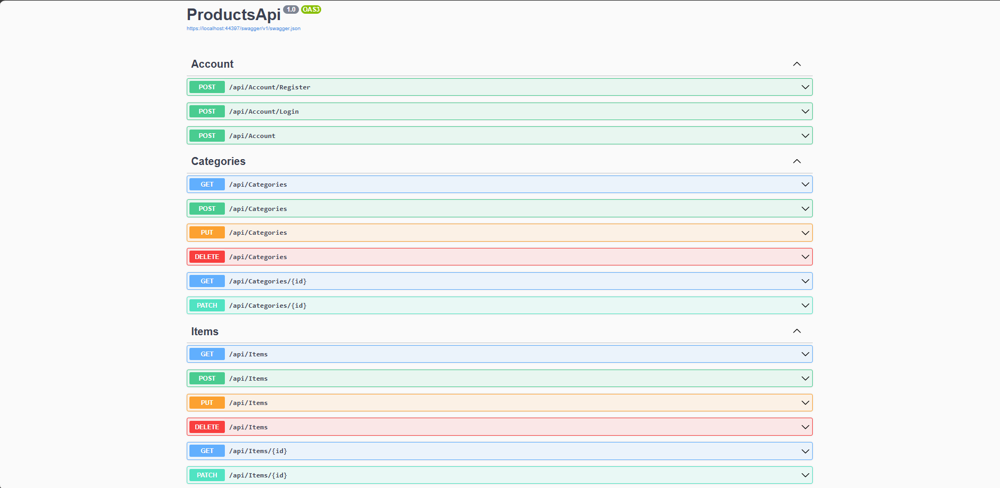

# Products API

This API provides functionalities for managing user accounts, categories, and items. It includes operations for registration, login, and CRUD operations for categories and items.

## Overview

The Products API allows you to:
- Manage user accounts, including registration and login.
- Manage categories, including creating, updating, deleting, and retrieving categories.
- Manage items, including adding, updating, and retrieving items.

## Endpoints

### Account Endpoints

| Method | Endpoint                 | Description               |
|--------|---------------------------|---------------------------|
| POST   | `/api/Account/Register`   | Register a new user       |
| POST   | `/api/Account/Login`      | Log in an existing user   |
| POST   | `/api/Account`            | [Description not provided]|

### Category Endpoints

| Method | Endpoint                  | Description                     |
|--------|----------------------------|---------------------------------|
| GET    | `/api/Categories`          | Retrieve all categories         |
| POST   | `/api/Categories`          | Add a new category              |
| PUT    | `/api/Categories`          | Update an existing category     |
| DELETE | `/api/Categories`          | Delete a category               |
| GET    | `/api/Categories/{id}`     | Get category by ID              |
| PATCH  | `/api/Categories/{id}`     | Partially update a category     |

### Item Endpoints

| Method | Endpoint                  | Description                     |
|--------|----------------------------|---------------------------------|
| GET    | `/api/Items`               | Retrieve all items              |
| POST   | `/api/Items`               | Add a new item                  |
| PUT    | `/api/Items`               | Update an existing item         |
| DELETE | `/api/Items`               | Delete an item                  |
| GET    | `/api/Items/{id}`          | Get item by ID                  |
| PATCH  | `/api/Items/{id}`          | Partially update an item        |

## Technologies Used

    C#
    SQL Server
    .NET
    ASP.Net Core WebAPI

## Image
 
